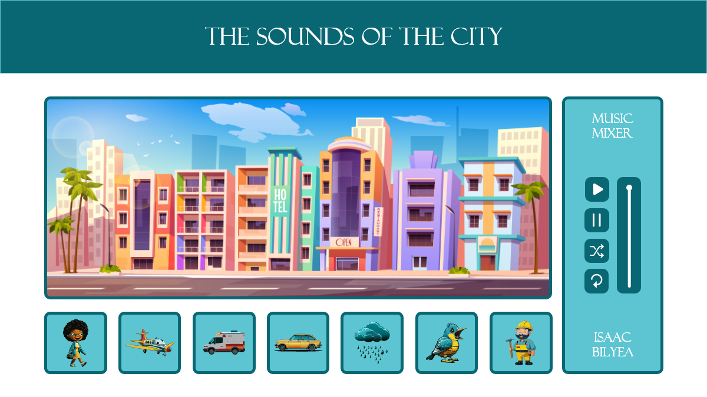

# The Sounds of the City - Music Mixer

Welcome to 'The Sounds of the City', an immersive music mixer application that brings the diverse and vibrant sounds of urban life right to your fingertips. With an intuitive drag-and-drop interface, users can mix and match common city sounds, creating unique audio tracks that capture the essence of urban landscapes. Inspired by innovative platforms like Incredibox, our project uses HTML, CSS, and JavaScript to offer a dynamic experience where the rhythm and soul of the city come alive. Dive into an auditory exploration of city life and craft your own urban symphony.

## Installation

There is no installation required.

## Usage

Open index.html in the browser of your choice.

## Contributing

1. Fork it!
2. Create your feature branch: `git checkout -b my-new-feature`
3. Commit your changes: `git commit -am 'Add some feature'`
4. Push to the branch: `git push origin my-new-feature`
5. Submit a pull request :D

## History

February 6th 2024
March 7th 2024
March 21st 2024
March 24th 2024

## Credits

Isaac Bilyea

## License

MIT - please see license file.
